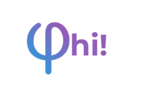

Bem-vindo ao **PHI**, uma plataforma mobile de estudos gamificada, feita em React Native, que reúne questões, artigos, áudios, vídeos, chat, loja de itens e muito mais para ajudar estudantes a aprenderem de forma divertida e eficiente!

---
<p align="center">
  
  
  
  
  
  
  
  
</p>

## ✨ Funcionalidades

- **Login e Cadastro**: Fluxo completo com validação de campos.
- **Home**: Feed com carrossel de banners, assuntos populares e sugestões.
- **Questões**: Resolva questões de múltipla escolha, verdadeiro/falso, veja explicações, ganhe XP e moedas.
- **Artigos, Áudios e Vídeos**: Consuma conteúdos educativos em diferentes formatos.
- **Banca de Estudos**: Navegue por conteúdos filtrados por tipo.
- **Chat**: Converse com outros usuários e tire dúvidas.
- **Perfil**: Veja conquistas, estatísticas, seguidores, assuntos favoritos e conquiste troféus.
- **Loja**: Compre molduras, papéis de parede, ícones e assine o PHI Premium para benefícios exclusivos.
- **Notificações**: Drawer lateral com notificações do sistema e da comunidade.
- **Gamificação**: Sistema de XP, moedas, conquistas e ranking.
- **Customização**: Personalize seu perfil com itens da loja.
- **Acessibilidade**: Interface adaptada para diferentes tamanhos de tela.

---

## 📱 Tecnologias Utilizadas

- **React Native** (Expo)
- **TypeScript**
- **React Navigation**
- **Phosphor Icons**
- **react-native-confetti-cannon**
- **expo-av** (sons)
- **Context API** (notificações)
- **Styled Components/StyleSheet**
- **Arquitetura modularizada**

---

## 🚀 Instalação e Execução

1. **Clone o repositório:**

   ```bash
   git clone https://github.com/seu-usuario/projeto-PHI.git
   cd projeto-PHI
   ```

2. **Instale as dependências:**

    ```bash
    npm install
    # ou
    yarn
    ```
3. **Rode o projeto:**
    ```bash
    npm run start
    # ou
    expo start
    ```
4. **Abra no seu emulador ou dispositivo físico usando o app Expo Go.**

## 🧩 Estrutura de Pastas

```bash
src/
  components/         # Componentes reutilizáveis (inputs, botões, cards, etc)
  screens/            # Telas principais (Home, Perfil, Questoes, etc)
  routes/             # Navegação (Stack, Tabs)
  assets/             # Imagens, ícones, temas
  Mocks/              # Dados mockados para desenvolvimento
  types/              # Tipagens TypeScript
  context/            # Contextos globais (ex: notificações)
```

## 🏆 Gamificação

- XP: Ganhe experiência ao resolver questões e interagir.
- Moedas: Use para comprar itens na loja.
- Conquistas: Troféus e badges por desempenho.
- Ranking: Compare seu progresso com outros usuários.

## ✍️ Colaboradores

- [Marcelly](https://github.com/marcyroz)
- [Vinicius](https://github.com/Vinicius-Caua)
- [Gustavo](https://github.com/PlayerBosta)
- [Johny](https://github.com/devJohnyRRS)

### **Bons estudos com o PHI! 🚀**


